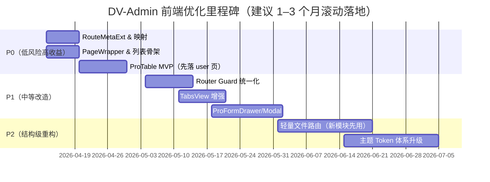
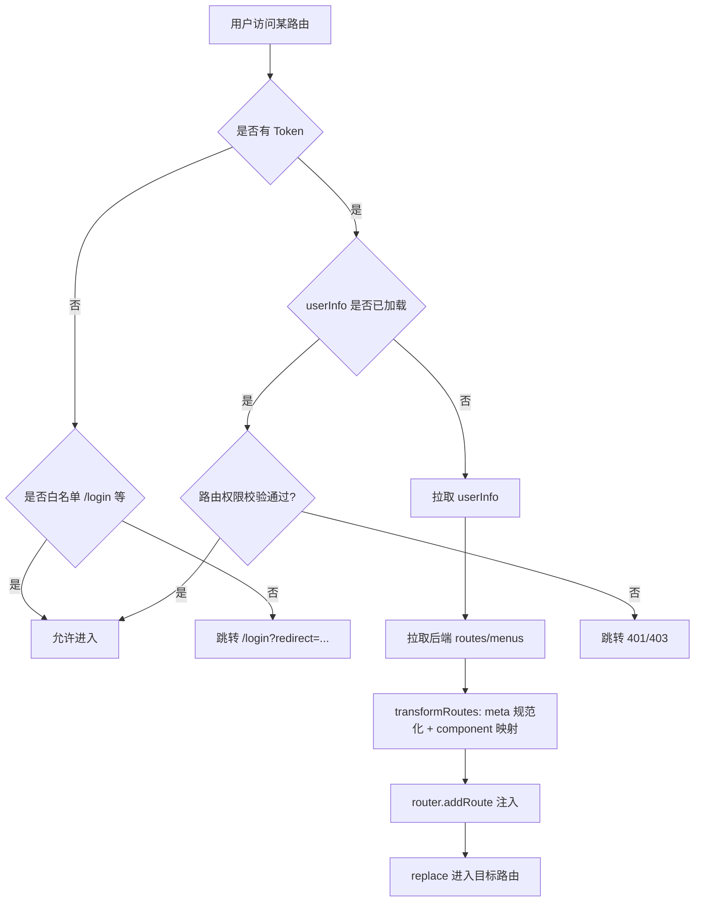

# DV-Admin 前端优化映射分析

## 执行摘要

本报告面向仓库 **DV-Admin（前端：Vue 3 + Vite + TypeScript + Element Plus）**，在“可逐步落地、面向 1–3 名前端工程师、1–3 个月持续优化”的约束下，给出一套**务实、可执行**的前端体验与工程优化方案，并将上轮 Top5 参考项目的优势映射到 DV-Admin：**pure-admin/vue-pure-admin、youlaitech/vue3-element-admin、soybeanjs/soybean-admin、un-pany/v3-admin-vite、yangzongzhuan/RuoYi-Vue3**。 citeturn38view1turn38view0turn42search0turn42search1turn42search2turn42search3

结论层面，DV-Admin 当前“可快速见效”的优化重点集中在三类：

第一类是**界面一致性与信息密度（P0）**：统一页面容器（PageWrapper）、统一列表页“搜索区 + 工具条 + 表格 + 分页”的骨架、减少重复样式与交互差异；这类改动风险低且收益大，能在 1–2 周内做出一套 MVP，并逐步推广到各业务页面（如系统用户页）。 citeturn24view0turn24view1turn24view2turn25view0

第二类是**权限路由与 Tab/KeepAlive 的“企业级体验”（P0–P1）**：DV-Admin 已有动态路由转换与按钮/角色指令，但需要补齐“路由 meta 规范化、缓存 key 策略、详情页 activeMenu、统一守卫流程（鉴权/拉取用户信息/动态注入路由/异常兜底）”。尤其是当前 `router/index.ts` 中未出现全局 `beforeEach/afterEach` 的守卫逻辑，建议固化为 `router/guard.ts` 并在 `main.ts` 注册，形成可维护的链路。 citeturn4view1turn28view1turn44view2turn44view3

第三类是**可复用的 Pro 级组件抽象（P1）**：DV-Admin 组件仓库中已存在 `components/CURD`（PageSearch/PageContent/PageModal/usePage）等雏形，但业务页面并未一致使用（例如用户页仍是手写搜索表单与表格），导致复用不足、迭代变慢。建议对齐行业通用实践，引入“ProTable（列配置/偏好存储/筛选折叠/工具条/请求驱动）+ ProFormDrawer/Modal”的组合，逐页迁移。 citeturn35view0turn36view0turn25view3turn24view2

在参考项目映射上：

- **vue-pure-admin** 有成熟的工程化与“表格条（列设置/固定列/信息密度）”思路，适合作为“中后台体验标杆”借鉴；其强调 ESM、性能与可落地的“精简版本”思想，对 DV-Admin 的提炼与瘦身也有直接启发。 citeturn42search0  
- **vue3-element-admin** 与 DV-Admin 在不少实现上高度接近（例如 Breadcrumb 逻辑几乎一致），属于“同源/同代系”参考，最适合直接对齐其路由与权限元信息（meta）规范，以及列表页与导航体验细节。 citeturn14view0turn12search8turn43view1  
- **soybean-admin** 强项在“严谨规范 + 自动化文件路由 + 主题/组件体系”，更适合作为 P2 的“结构级重构”路线参考（不建议一上来照搬 monorepo 形态，但可借鉴其路由自动化与规范体系）。 citeturn42search2  
- **v3-admin-vite** 在 Vue3+Vite+TS+Element Plus 模板化落地方面成熟，适于借鉴其工程体验与模板约束；其发展节奏与模板定位也适合作为“中等复杂度后台”的参考。 citeturn42search1turn43view4  
- **RuoYi-Vue3** 是企业侧最常见的生态之一，其“官方主推活跃版本/现代技术栈/类型化协作”的定位使其更适合作为“企业可维护性与协作范式”的对照参考。 citeturn42search3  

---

## DV-Admin 现状诊断与优先级

### 问题清单与优先级表

下表按你要求的 8 个维度给出：**当前状态摘要（含文件/位置引用）→ 问题/痛点 → 优先级**。其中“当前状态摘要”尽量引用 DV-Admin 的关键文件与实现点，便于你直接定位代码。

| 维度 | 当前状态摘要（基于仓库引用） | 主要问题/痛点 | 优先级 |
|---|---|---|---|
| 整体视觉风格 | 以 Element Plus 默认风格为基底；用户页搜索区、工具条、表格区域主要通过 `el-card` + 自定义 class 组装（如 `data-table__toolbar` / `data-table__content`）。citeturn24view1turn24view2 | 缺少统一 PageWrapper/Design Tokens（间距、圆角、阴影、标题/操作区层级）；页面之间信息密度与间距不一致，企业后台“紧凑/高密度”诉求无法规模化满足。 | 高 |
| 页面骨架与布局 | Layout 由 `layouts/index.vue` 根据 `layout`（left/top/mix）切换，支持路由 meta 覆盖布局（`route.meta.layout` 优先）。citeturn8view1 Left 布局包含 Sidebar、Navbar、TagsView、AppMain。citeturn10view4 | 缺少“页面级容器抽象”（统一标题、面包屑位置、操作按钮位、页内 Tabs/锚点等）；导致业务页只能自行拼装，迁移与统一成本高。 | 高 |
| 菜单/标签页/面包屑体验 | Navbar 引入 Hamburger + Breadcrumb + NavbarActions，并存在调试 `console.log`。citeturn13view0 Breadcrumb 基于 route.matched + `meta.title` + `meta.breadcrumb` 控制显示，支持动态参数 compile。citeturn14view0 TagsView 支持滚动、右键菜单（刷新/关闭/关闭左右/关闭其他/关闭全部）、affix 与 keepAlive 标记。citeturn16view2turn16view4turn16view3 | 1）Navbar 存在调试日志不应进入企业版本；2）TagsView 缺少“Tab 拖拽排序、锁定、最近关闭恢复、跨模块分组”等企业常用能力；3）面包屑/菜单高亮在“详情页/隐藏页”场景易缺少 `activeMenu` 规则。 | 高 |
| 列表页与搜索区 | 用户页采用“左侧部门树 + 右侧搜索表单 + 工具条 + el-table + 分页 + 抽屉表单”的经典结构。citeturn24view0turn24view1turn24view2turn25view0 查询/重置逻辑在页面内重复实现（`handleQuery/handleResetQuery/fetchData`）。citeturn24view5 | 缺少可复用的 ProTable 级抽象：列配置（隐藏/排序/固定）、搜索折叠、条件/列偏好存储、跨页选择、统一请求/分页协议、统一空态/骨架屏等；导致每个页面都要重复写“工具条+查询+分页+表格”。 | 高 |
| 表单页与详情页 | 用户页表单用 `el-drawer`，通过 `drawerSize` 做响应式（桌面 600px，移动 90%），表单校验与提交使用防抖。citeturn25view0turn25view6turn24view4 | 表单抽屉/弹窗的结构（标题/加载态/底部按钮/关闭重置/数据回填）在各页面难以统一；缺少“ProFormDrawer/useForm”等可复用结构，导致交互质量与代码质量随页面波动。 | 中 |
| 权限与路由体验 | 动态路由由 `permission-store.ts` 获取后端 routes 并 `transformRoutes` 转换组件、处理 `Layout` 等。citeturn4view1turn4view2 按钮/角色权限通过 `v-hasPerm`/`v-hasRole` 指令移除 DOM 元素实现。citeturn28view1turn23view3 `router/index.ts` 未检索到 `beforeEach/afterEach`，更像“仅定义路由表”。citeturn44view2turn44view3 | 1）缺少统一的路由守卫链路（token→拉 userInfo→拉 routes→注入→异常兜底）；2）缺少 meta 规范化（`activeMenu/alwaysShow/noCache/cacheKey` 等）；3）按钮权限直接 remove DOM 在企业产品通常需要“禁用+提示原因/灰显”策略（审计/可发现性更友好）。 | 高 |
| 主题能力 | `settings-store.ts` 通过 `useStorage` 持久化 layout、themeColor、theme（亮/暗）等，watch 主题变化并调用 `utils/theme.ts` 写入 Element Plus CSS 变量与暗黑 class。citeturn31view1turn34view0turn34view1 还支持侧边栏配色方案（blue scheme）。citeturn31view1turn34view1 | 主题体系已具备雏形，但缺少“企业级主题面板”的完整 token：密度（compact）、字号、圆角、边框、间距、菜单宽度、页面背景层级等；也缺少“跟随系统”模式。 | 中 |
| 代码结构与组件抽象 | `src/components` 中已有较多通用组件（Breadcrumb、Pagination、OperationColumn、MenuSearch 等）并存在 `components/CURD` 模块（PageSearch/PageContent/PageModal/usePage）。citeturn35view0turn36view0 但实际业务页（如用户页）仍大量手写“搜索+表格”。citeturn24view1turn24view2 | 组件抽象“有库但没形成范式”：缺少明确的 Pro 组件 API（数据驱动、schema 驱动、偏好存储、权限融合），导致复用率低、规范不易推广。 | 高 |

---

## Top5 优势到 DV-Admin 的映射

### 关键观察

DV-Admin 与 `youlaitech/vue3-element-admin` 在部分实现上呈现强一致性：**Breadcrumb 组件的核心逻辑（route.matched、dashboard 注入、meta.breadcrumb 控制、path-to-regexp compile）几乎是同一份代码**。这意味着 DV-Admin 可以更激进地对齐“vue3-element-admin 系”的 meta 规范与页面范式，在成本可控的情况下快速提升成熟度。 citeturn14view0turn12search8

### 映射表

表格说明：  
- **直接借鉴**：可在 DV-Admin 以相同思路/类似 API 落地；  
- **需改造后借鉴**：理念可借鉴，但需适配 DV-Admin 的路由结构、后端契约、组件库与现有实现；  
- **不建议采用**：与现有架构冲突过大或收益不匹配（通常推迟到 P2 或放弃）。

| 来源项目（Top5） | 值得借鉴的优点（抽象能力） | DV-Admin 是否可采用 | DV-Admin 落地模块（示例） | 改造要点/替代方案 |
|---|---|---|---|---|
| vue-pure-admin | 强工程化与性能意识：ESM、可提炼“精简版本”、强调打包体积与可维护性；并在表格条组件上持续迭代（如固定列能力）。citeturn42search0 | 需改造后借鉴 | `frontend/package.json` 构建脚本、拆包策略；`src/components` 表格增强组件 | 不建议把其完整工程体系整体搬入 DV-Admin；建议只抽取“ProTableBar/列设置/固定列/偏好存储”与“精简版本思想（可选模块）”。 |
| vue3-element-admin | 路由组织与“Layout + constantRoutes”范式成熟，适合对齐其 meta 语义（title/breadcrumb 等）；与 DV-Admin 同源度高。citeturn43view1 | 直接借鉴（同代系） | `src/router/index.ts`、`src/store/modules/permission-store.ts`、`src/components/Breadcrumb` | 建议把 DV-Admin 的 route meta 规范化（见后文 RouteMetaExt），并将后端 routes 映射到统一 meta。 |
| vue3-element-admin | 面包屑交互细节成熟（dashboard 注入、动态参数 compile、breadcrumb=false 隐藏）。citeturn12search8 | 已采用（对齐即可） | `src/components/Breadcrumb/index.vue` | 既然实现已高度一致，建议把 Breadcrumb 的 meta 规范写入 RouteMetaExt，并统一后端菜单字段。 |
| soybean-admin | 严谨规范 + 自动化文件路由系统 + 主题配置丰富（定位为“功能强大模板/自动化文件路由/monorepo”）。citeturn42search2 | 需改造后借鉴 | P2：`src/router`、`src/views`、lint/规范与目录约束 | 不建议一开始引入 monorepo 形态；但可借鉴其“文件路由自动生成 + meta 注解”的思想，在 DV-Admin 内部实现轻量 file-route（见 P2）。 |
| v3-admin-vite | Vue3+Vite+TS+Element Plus 模板化成熟；定位为“crafted admin template”，工程节奏活跃，适合作为中等复杂度后台参考。citeturn42search1turn43view4 | 需改造后借鉴 | `src/router`、`src/store`、工程规范（lint/husky） | 可借鉴其模板约束：统一代码风格/目录、标准化 token 存储策略与登录链路。 |
| RuoYi-Vue3 | “官方主推活跃版本/现代技术栈/类型化协作”导向，企业生态与资料丰富，适合作为企业约定与协作范式对照。citeturn42search3 | 需改造后借鉴 | 权限模型、菜单/按钮/接口权限的契约设计 | 不建议直接照搬其全部业务模块；建议借鉴“权限粒度与字典/菜单等基础域建模方式”，并将 meta/权限字段与后端契约统一。 |

---

## 改造路线图

### 路线图总览表

估算口径：**人日**按“1 人 1 天有效开发/联调/自测”计算；难度（1–5）综合考虑：改动面、回归风险、对后端契约依赖、团队熟悉度。

| 阶段 | 改动目标（摘要） | 预期收益 | 影响模块（示例） | 难度 | 估算工时（人日） | 风险与回退策略 | 参考项目 |
|---|---|---|---|---:|---:|---|---|
| P0 | RouteMetaExt 规范 + 后端菜单字段映射（最小集） | “菜单/面包屑/Tab/缓存”语义统一，后续功能可规模化落地 | `src/store/modules/permission-store.ts`、`src/router/index.ts`、`src/layouts/components/TagsView` | 3 | 3–5 | 风险：后端字段不齐；回退：兼容旧字段映射（保持 transformRoutes 双分支） | vue3-element-adminciteturn43view1turn12search8 |
| P0 | 统一页面容器 PageWrapper + 列表页骨架模板 | 视觉与信息密度一致；新页面产出速度提升 | `src/components` 新增 `PageWrapper`；业务页逐步接入 | 2 | 2–4 | 风险：样式冲突；回退：只在新页面启用，旧页面不动 | vue-pure-adminciteturn42search0 |
| P0 | ProTable MVP：列配置（显隐/顺序）+ 搜索折叠 + 偏好存储 | 列表页体验跃升；显著减少重复代码 | `src/components` 新增 `ProTable`；`src/utils/storage` | 3 | 5–8 | 风险：页面迁移成本；回退：逐页迁移（先 user 页），保留旧实现 | vue-pure-adminciteturn42search0 |
| P0 | 清理 Navbar 调试日志 + 统一导航细节 | 提升专业性；减少噪音日志 | `src/layouts/components/NavBar/index.vue` | 1 | 0.5 | 风险极低；回退：无 | —citeturn13view0 |
| P1 | 统一路由守卫 guard（鉴权/拉 userInfo/拉 routes/注入/异常兜底） | 登录与权限链路更稳；减少“偶现进不去/刷新丢菜单”等问题 | `src/router/guard.ts`（新增）、`src/main.ts`（注册） | 4 | 4–7 | 风险：影响全站跳转；回退：feature flag 开关（env 或 setting），可切回旧逻辑 | v3-admin-viteciteturn42search1turn43view4 |
| P1 | TabsView 增强：拖拽排序/锁定/恢复最近关闭/activeMenu | 企业级多任务体验 | `src/layouts/components/TagsView/index.vue`、`src/store/modules/tags-view-store.ts` | 3 | 4–8 | 风险：与 keepAlive/cacheKey 耦合；回退：维持旧 tags 数据结构并做渐进增强 | vue3-element-adminciteturn12search8 |
| P1 | ProFormDrawer/Modal 组件化 | 表单交互一致；减少重复重置/回填/校验代码 | `src/components`、业务表单页 | 3 | 5–10 | 风险：表单差异大；回退：同 ProTable 一样逐页迁移 | —citeturn25view0turn25view6 |
| P2 | “轻量文件路由”与目录约束（替代手写 routes） | 路由维护成本下降；更易规模化扩展模块 | `src/router`、`src/views`、脚手架/生成器 | 5 | 10–20 | 风险：结构级变更；回退：保留旧 routes（双轨），只对新模块启用 | soybean-adminciteturn42search2 |
| P2 | 主题 token 体系升级（密度/字号/圆角/间距/菜单宽度/跟随系统） | 统一品牌感与可配置性；适配多场景 | `src/store/modules/settings-store.ts`、`src/utils/theme.ts`、全局 styles | 4 | 8–15 | 风险：CSS 回归；回退：token 默认值与旧变量兼容（增量变量） | soybean-adminciteturn42search2 |

### 路线图里程碑图



---

## 技术实施细则与可执行建议

> 本节按“每条建议都包含：改动目标、预期收益、可能影响模块、实施难度、估算工时、风险与回退、参考项目（含 repo 或文件路径）+ 可执行步骤要点”的格式展开。  
> 其中 DV-Admin 的落地文件尽量给出 **明确路径**；参考项目由于部分仓库结构差异，优先引用其官方仓库描述或已定位到的关键文件（router 等）。

### 建议一：建立 RouteMetaExt 规范并在动态路由转换中统一落地

改动目标：在 DV-Admin 建立一套**企业后台通用**的 `RouteMetaExt`（title/icon/hidden/breadcrumb/keepAlive/affix/activeMenu/perms/roles/cacheKey 等），并在 `permission-store.ts` 的 `transformRoutes` 中把后端菜单字段**规范化映射**到 meta。  
预期收益：菜单、面包屑、标签页、KeepAlive、权限控制有统一语义；避免后续功能“到处加 if”。  
可能影响模块：`src/store/modules/permission-store.ts`（动态路由转换）、`src/router/index.ts`（静态路由 meta）、`src/layouts/components/Menu/BasicMenu.vue`、`src/layouts/components/TagsView/index.vue`、`src/components/Breadcrumb/index.vue`。citeturn4view1turn44view1turn16view3turn14view0turn10view4  
实施难度：3/5  
估算工时：3–5 人日  
风险与回退策略：风险在于后端菜单字段不一致/缺失；回退策略是保留旧字段兼容分支（例如 `meta.title ?? route.name`），并确保 `transformRoutes` 对缺失字段给默认值。  
参考项目：`youlaitech/vue3-element-admin`（router 管理范式对齐）citeturn43view1turn12search8

可执行技术步骤要点（伪代码/步骤）：

1）新增类型声明（建议放在 `frontend/src/types/router-meta.d.ts` 或 `src/types/router.ts`）

```ts
// RouteMetaExt（建议最小集先落地，之后迭代）
export interface RouteMetaExt {
  title?: string;             // i18n key or display title
  icon?: string;
  hidden?: boolean;           // hide from menu
  breadcrumb?: boolean;       // default true
  affix?: boolean;            // pin in tags-view
  keepAlive?: boolean;
  cacheKey?: string;          // stable keep-alive key (avoid fullPath explosion)
  activeMenu?: string;        // highlight which menu when in hidden/detail page
  perms?: string[];           // route-level permissions
  roles?: string[];           // route-level roles
  layout?: 'left'|'top'|'mix';// optional override
}
```

2）在 `permission-store.ts` 的 `transformRoutes` 里做 meta 规范化：  
当前 `transformRoutes` 已处理 `component === "Layout"` 与动态 import，并递归 children。citeturn4view1  
建议增加 `normalizeMeta(raw: any): RouteMetaExt`，并在每个 route 进入 store 之前统一清洗：

```ts
function normalizeMeta(rawMeta: any): RouteMetaExt {
  const meta = rawMeta ?? {};
  return {
    title: meta.title ?? meta.name ?? '',
    icon: meta.icon,
    hidden: Boolean(meta.hidden),
    breadcrumb: meta.breadcrumb !== false,
    affix: Boolean(meta.affix),
    keepAlive: Boolean(meta.keepAlive),
    cacheKey: meta.cacheKey,          // 后端可选传，或前端生成
    activeMenu: meta.activeMenu,
    perms: meta.perms ?? meta.permissions ?? [],
    roles: meta.roles ?? [],
    layout: meta.layout
  };
}

// transformRoutes 内，对 route.meta 赋值统一化
route.meta = normalizeMeta(route.meta);
```

3）后端契约同步策略（你允许调整后端契约）：  
- 后端返回的菜单节点建议包含：`path、name、component、redirect、children、meta(title/icon/hidden/keepAlive/affix/breadcrumb/activeMenu/perms/roles/cacheKey)`；  
- 对“详情页路由”建议后端或前端生成 `activeMenu = '/system/user'` 以便菜单高亮。

---

### 建议二：优化 KeepAlive 与 Tabs 缓存策略，引入 cacheKey，避免 fullPath 级爆炸

改动目标：把 KeepAlive 的 include 维度从“fullPath（含 query/动态参数）”升级为“稳定 cacheKey（或 route.name）”，并保留对少数需要 query 维度缓存的例外策略。  
现状依据：DV-Admin 的 `AppMain` 明确使用 `route.fullPath` 作为 wrapper component 名称以配合 `<keep-alive :include="cachedViews">`，同时用 `wrapperMap` 做缓存并做数量上限（>100移除最早）。citeturn15view0 TagsView 将 `keepAlive` 标记写入 tag，并在刷新时 `delCachedView` 后用 `/redirect` + `fullPath` 触发刷新。citeturn16view3turn16view7  
问题/痛点：fullPath 作为缓存 key 会把 query、分页、筛选等都变成不同缓存项；虽然有 100 上限，但仍可能导致“缓存命中不可控/内存不可控/用户觉得 keepAlive 不稳定”。  
预期收益：缓存更稳定、可控；“列表页返回保持筛选/滚动位置”与“详情页不缓存”能更明确地表达。  
可能影响模块：`src/layouts/components/AppMain/index.vue`、`src/store/modules/tags-view-store.ts`、`src/layouts/components/TagsView/index.vue`、`src/router/index.ts`。citeturn15view0turn16view3turn44view1  
实施难度：4/5  
估算工时：4–6 人日  
风险与回退策略：风险在于部分页面依赖 fullPath 粒度缓存；回退：提供 `meta.cacheKeyPolicy = 'fullPath'|'name'` 的开关，默认 name，仅少数页面设 fullPath。  
参考项目：`youlaitech/vue3-element-admin` 系通常以 route.name/noCache 控制 keepAlive（同代可对齐路线）；`vue-pure-admin` 的表格/页面体验通常更强调“可控复用与偏好”。citeturn42search0turn12search8

可执行步骤要点：

1）在 RouteMetaExt 中正式引入 `cacheKey`（或 `cacheKeyPolicy`）。  
2）修改 `AppMain`：把 `componentName` 从 `route.fullPath` 改为优先 `route.meta.cacheKey`，缺省使用 `route.name`：

```ts
const componentName = (route.meta?.cacheKey as string) || (route.name as string) || route.fullPath;
```

3）修改 TagsView：cachedViews 存储同一策略的 key，而不是 fullPath；tag 上仍保留 fullPath 用于导航。  
4）对“详情页/编辑页”推荐设置：  
- `keepAlive = false`（默认不缓存）；  
- `activeMenu = 列表页 path`（用于菜单高亮）；  
- 如需缓存（例如多步骤表单），用稳定 cacheKey（例如 `UserEdit`）而不是带 id 的 fullPath。

---

### 建议三：把 Router 守卫流程固化为 `router/guard.ts`，形成“鉴权→拉取→注入→兜底”的可维护链路

改动目标：补齐并固化企业后台常见的路由守卫链路（token 判断、用户信息、动态路由注入、异常处理、标题等），避免逻辑分散或隐式耦合。  
现状依据：`router/index.ts` 当前展示的是静态路由定义与 meta（如 dashboard 的 affix/keepAlive），但未检索到 `beforeEach/afterEach`。citeturn44view1turn44view2turn44view3  
预期收益：减少“刷新后菜单空/权限异常/偶发跳转问题”；鉴权更清晰，后续引入 SSO、多租户、二次校验更安全。  
可能影响模块：`src/router/guard.ts`（新增）、`src/main.ts`（注册）、`src/store/modules/user-store.ts`（若需补齐加载状态）、`src/store/modules/permission-store.ts`（generateRoutes）。citeturn4view2turn40view0  
实施难度：4/5  
估算工时：4–7 人日  
风险与回退策略：风险是全站跳转链路变化；回退：用环境变量或 setting 开关守卫（比如 `VITE_ENABLE_ROUTER_GUARD`），紧急时关闭回到“无守卫/旧逻辑”。  
参考项目：`v3-admin-vite`（模板化后台项目常见做法）；`vue3-element-admin`（路由组织同代对齐）。citeturn42search1turn43view1turn43view4

推荐的守卫流程示意：



实现要点（伪代码）：

```ts
// src/router/guard.ts
export function setupRouterGuard(router) {
  router.beforeEach(async (to, from, next) => {
    // 1) token 判断
    // 2) userInfo 未加载时：await userStore.getUserInfo()
    // 3) routes 未注入时：await permissionStore.generateRoutes(); addRoute(...)
    // 4) 权限不通过：next('/401')
    // 5) 设置标题：document.title = ...
  });
}
```

---

### 建议四：引入统一 PageWrapper，固化“页面层级与信息密度”的企业后台风格

改动目标：为所有页面提供统一的“页面外壳”：标题区（左标题、右操作）、面包屑位、内容区 padding、背景层级、可选的 tabs/锚点等，避免每个页面重复自定义容器与间距。  
现状依据：用户页当前以 `app-container` + `el-row/el-col/el-card` 拼装，页面风格主要靠页面内 class 自行维护。citeturn24view0turn24view1turn24view2  
预期收益：视觉一致性显著提升；新页面开发速度更快；后续做主题 token（密度/间距）更容易“一处修改全站生效”。  
可能影响模块：新增 `src/components/PageWrapper`、业务页逐步接入；样式在 `src/styles` 补齐。citeturn35view0turn40view0  
实施难度：2/5  
估算工时：2–4 人日  
风险与回退策略：风险主要是样式冲突；回退：只对新页面或某一模块启用，旧页面保持原样。  
参考项目：`vue-pure-admin`（作为信息密度/中后台风格标杆，强调模板可落地与精简版本思想）。citeturn42search0

PageWrapper 建议 API（示例）：

```vue
<PageWrapper
  :title="t('system.user.title')"
  :breadcrumbs="true"
  :dense="settings.density === 'compact'"
>
  <template #extra>
    <el-button type="primary">新增</el-button>
  </template>

  <!-- 页面主体 -->
</PageWrapper>
```

---

### 建议五：ProTable MVP（面向列表页），并把“列偏好存储”作为第一优先级能力

改动目标：实现一个可复用的 ProTable（可在 Element Plus 上封装），至少包含：  
- 搜索区 schema 化（可折叠/展开）；  
- 工具条 slots（新增/删除/导入/导出）；  
- 列配置（显隐/顺序；可选固定列）；  
- 与分页、请求统一协议（pageNum/pageSize/total/list）；  
- 列偏好 + 搜索偏好存储（按 userId + routeKey）。  

现状依据：用户页已具备工具条与分页、查询重置等典型逻辑，但都写在页面内，且导入/导出工具条位存在注释代码，显示“未来会反复出现此需求”。citeturn25view3turn24view5  
预期收益：减少重复代码；列表体验更接近企业后台；形成“可推广的范式”。  
可能影响模块：新增 `src/components/ProTable`、`src/composables/useProTable`、`src/utils/storage`；逐页迁移（先 system/user）。citeturn24view2turn35view0  
实施难度：3/5  
估算工时：5–8 人日（MVP 版本）  
风险与回退策略：风险在于页面差异造成迁移阻力；回退：只替换一个页面（User），保留旧实现作为 fallback，通过 feature flag 切换。  
参考项目：`vue-pure-admin` 的“表格条组件持续迭代（固定列）”是极强参考信号；`vue3-element-admin` 系是“同代范式”参考。citeturn42search0turn12search8

可执行技术步骤要点（含偏好存储）：

1）定义偏好存储 key：

```ts
// key = userId + routeKey（建议 routeKey = route.name 或 meta.cacheKey）
const prefKey = `protable:${userId}:${routeKey}`;
```

2）定义列 schema（简化示例）：

```ts
type ProColumn = {
  key: string;
  title: string;
  dataIndex?: string;
  width?: number;
  fixed?: 'left'|'right';
  hideable?: boolean;
  defaultVisible?: boolean;
};
```

3）实现列设置 UI（最小可用：Drawer/Popover + Checkbox 列表 + 拖拽排序）：  
DV-Admin 前端依赖中已包含 `sortablejs` 与 `vue-draggable-plus`，可以直接用于列拖拽排序。citeturn38view1

4）存储与恢复：

```ts
// onMounted: load prefs -> apply to columns
// onChange: save prefs
```

5）请求驱动：抽象统一 `request(params)`，约束返回 `{ list, total }`（用户页现状已经如此）。citeturn24view5

---

### 建议六：统一“列表页左侧树 + 右侧列表”的布局模板，并收敛为可复用组件

改动目标：把用户页中的“DeptTree 左侧树 + 右侧列表”沉淀为可复用布局组件（例如 `MasterDetailLayout` 或 `SidebarFilterLayout`）。  
现状依据：用户页已使用 `el-row` + `el-col` 做左右结构，并用 `DeptTree v-model` 直接驱动查询。citeturn24view0turn24view5  
预期收益：组织架构、菜单树、字典树等页面可以统一布局与交互。  
可能影响模块：`src/components` 新增布局；`views/system/*` 页逐步接入。  
实施难度：2/5  
估算工时：2–3 人日  
风险与回退策略：风险低；回退：只用在新页面。  
参考项目：`RuoYi-Vue3` 在企业基础域（组织/角色/菜单）页面上广泛使用类似骨架（作为对照参考）。citeturn42search3

---

### 建议七：升级 TagsView（多标签页）为“企业多任务”体验

改动目标：在现有 TagsView 基础上增加：  
- Tab 拖拽排序；  
- Tab 锁定（除 affix 外可锁定）；  
- 最近关闭恢复；  
- 与 `activeMenu` 配合：详情页/隐藏页打开时，菜单高亮仍指向列表页；  
- 刷新策略与 keepAlive/cacheKey 对齐（见建议二）。  

现状依据：TagsView 已存在右键菜单、refresh/close 等操作，并基于 `affix` 与 `keepAlive` 做控制。citeturn16view2turn16view3turn16view7  
预期收益：大幅提升中后台多任务处理效率；也更符合“中台/企业”用户习惯。  
可能影响模块：`layouts/components/TagsView/index.vue`、`store/modules/tags-view-store.ts`、`layouts/components/AppMain/index.vue`。citeturn15view0turn16view4  
实施难度：3/5  
估算工时：4–8 人日  
风险与回退策略：风险在于缓存 key 变更导致体验波动；回退：保留原 tags 数据结构字段（fullPath/name），增强字段可选，不破坏旧逻辑。  
参考项目：`vue3-element-admin` 系在多标签页/面包屑与 meta 语义上更成熟；DV-Admin 已同时具备 `/redirect` 刷新方案。citeturn16view7turn12search8

---

### 建议八：把按钮权限从“移除 DOM”升级为“可配置：移除/禁用/提示原因”

改动目标：在 `v-hasPerm`/`v-hasRole` 指令基础上，增加策略：  
- 默认仍可移除（保持现状）；  
- 可选 `disabled` 模式（禁用并可提示为什么无权限，适合企业产品审计/可发现性）；  
- 对 `*:*:*` 与 root role 保持当前短路逻辑。  

现状依据：当前指令在 mounted 时判断权限，不通过就 `removeChild(el)`。citeturn28view1turn23view3  
预期收益：企业后台更符合“可发现性”与“最小惊讶”；减少用户“按钮怎么不见了”的困惑。  
可能影响模块：`src/directives/permission/index.ts`、通用按钮组件（可选）。citeturn28view1  
实施难度：2/5  
估算工时：2–4 人日  
风险与回退策略：风险低；回退：策略默认保持 remove。  
参考项目：RuoYi 系生态常见“按钮根据权限显示/禁用”实践（对照参考）。citeturn42search3

实现要点（伪代码）：

```ts
// v-hasPerm="{ perms: ['x:y:z'], mode: 'remove'|'disable' }"
if (!hasAuth) {
  if (mode === 'remove') el.parentNode?.removeChild(el);
  else {
    el.setAttribute('disabled', 'true');
    el.classList.add('is-permission-disabled');
    // 可选：挂 tooltip
  }
}
```

---

### 建议九：主题体系升级为“Token 驱动”，补齐密度与跟随系统

改动目标：在现有 themeColor/darkMode 基础上，增加：  
- `density: default | compact`（表格 padding、表单间距、按钮 size）；  
- `radius、fontSize、pagePadding、menuWidth` 等核心 token；  
- `theme: light | dark | auto（跟随系统）`。  

现状依据：`settings-store.ts` 已 watch `theme/themeColor` 并通过 `utils/theme.ts` 写入 Element Plus CSS 变量、切换暗黑 class。citeturn31view1turn34view0turn34view1  
预期收益：真正实现“企业后台可配置风格”；同一套页面可适配不同客户/系统风格。  
可能影响模块：`settings-store.ts`（新增持久化字段）、`utils/theme.ts`（写入更多变量）、全局 scss/uno。citeturn31view1turn34view2  
实施难度：4/5  
估算工时：8–15 人日（建议 P2）  
风险与回退策略：风险为 CSS 回归；回退：新增 token 默认值与旧变量兼容，不移除旧变量。  
参考项目：`soybean-admin` 明确强调主题配置与严谨规范；适合作为 token 化方向标杆。citeturn42search2

---

## 最小可行优化包（MVP）

> 目标：**1–2 周完成**，能明显提升 DV-Admin 的“企业后台成熟度”，同时为后续 P1/P2 铺路。建议以“系统用户页”作为首个迁移样板。

### MVP 任务表

| 任务 | 优先级 | 估时（人日） | 验收标准 | 回滚方案 |
|---|---:|---:|---|---|
| 清理 Navbar 调试日志（console.log）并加 lint 规则防止提交 | P0 | 0.5 | Navbar 无调试输出；CI/本地 lint 能拦截新增 console（可配置白名单） | revert 单 commit citeturn13view0turn38view5 |
| RouteMetaExt 最小集落地（title/icon/hidden/breadcrumb/keepAlive/affix/activeMenu）+ 后端映射（兼容旧字段） | P0 | 3 | 动态菜单路由注入后：菜单/面包屑/TagsView 使用统一 meta；旧字段仍可工作 | 保留旧映射分支；可通过开关回退到旧 meta citeturn4view1turn16view3turn14view0 |
| KeepAlive cacheKey 策略 MVP（先不改全站：仅对列表页生效） | P0 | 2 | 列表页返回保持状态且缓存项数量可控；不会因 query 变化导致大量缓存项 | cacheKeyPolicy 回退为 fullPath（逐页开关） citeturn15view0turn16view7 |
| PageWrapper（页面容器）组件 + 在 system/user 试点接入 | P0 | 2 | user 页标题/操作区/内容区间距统一；不影响现有功能 | user 页恢复旧包裹结构即可 citeturn24view0turn24view1 |
| ProTable MVP：列显隐 + 列顺序（拖拽）+ 偏好存储（localStorage）+ 在 system/user 接入 | P0 | 5–7 | user 页可配置列显示与顺序；刷新后偏好保留；不破坏权限按钮显示 | feature flag 切回旧 table；保留旧页面实现代码路径 citeturn24view2turn25view3turn38view1turn42search0 |
| 搜索区折叠/展开（字段多时默认折叠）+ 搜索条件偏好存储 | P0 | 2–3 | 字段较多时可折叠；刷新可恢复用户上次搜索条件；重置清空 | 关闭偏好存储开关；不影响查询逻辑 citeturn24view1turn24view5 |

### MVP 完成后的“样板页面”验收清单

- system/user 页面达到一个“可复用模板”的标准：  
  - 搜索区：schema 驱动 + 折叠；  
  - 表格：列偏好 + 工具条 slots；  
  - 分页/请求：统一协议；  
  - 权限：按钮权限仍有效（`v-hasPerm`）且交互无倒退；  
  - 返回保持：列表页返回时筛选与列偏好可保留。citeturn23view3turn24view5turn28view1

---

## 参考来源

> 按你的要求：优先官方/主仓库 README 或 docs；同时优先 DV-Admin 仓库内文件。为满足系统限制，链接以代码块形式列出（便于你直接打开）。

```text
DV-Admin（目标仓库）
- https://github.com/TingRuDeng/DV-Admin
- https://github.com/TingRuDeng/DV-Admin/blob/master/frontend/package.json
- https://github.com/TingRuDeng/DV-Admin/blob/master/frontend/src/layouts/index.vue
- https://github.com/TingRuDeng/DV-Admin/blob/master/frontend/src/layouts/modes/left/index.vue
- https://github.com/TingRuDeng/DV-Admin/blob/master/frontend/src/layouts/components/AppMain/index.vue
- https://github.com/TingRuDeng/DV-Admin/blob/master/frontend/src/layouts/components/TagsView/index.vue
- https://github.com/TingRuDeng/DV-Admin/blob/master/frontend/src/layouts/components/NavBar/index.vue
- https://github.com/TingRuDeng/DV-Admin/blob/master/frontend/src/components/Breadcrumb/index.vue
- https://github.com/TingRuDeng/DV-Admin/blob/master/frontend/src/views/system/user/index.vue
- https://github.com/TingRuDeng/DV-Admin/blob/master/frontend/src/store/modules/settings-store.ts
- https://github.com/TingRuDeng/DV-Admin/blob/master/frontend/src/utils/theme.ts
- https://github.com/TingRuDeng/DV-Admin/blob/master/frontend/src/directives/permission/index.ts
- https://github.com/TingRuDeng/DV-Admin/blob/master/frontend/src/store/modules/permission-store.ts
- https://github.com/TingRuDeng/DV-Admin/blob/master/frontend/src/components/CURD/PageSearch.vue

Top5 参考项目
- https://github.com/pure-admin/vue-pure-admin
- https://github.com/pure-admin/vue-pure-admin/blob/main/src/router/index.ts
- https://github.com/youlaitech/vue3-element-admin
- https://github.com/youlaitech/vue3-element-admin/blob/master/src/router/index.ts
- https://github.com/youlaitech/vue3-element-admin/blob/master/src/store/modules/permission.ts
- https://github.com/Soybeanjs/soybean-admin
- https://github.com/un-pany/v3-admin-vite
- https://github.com/un-pany/v3-admin-vite/blob/main/src/router/index.ts
- https://github.com/yangzongzhuan/RuoYi-Vue3
```

